# Platinum
Hairdresser salon

[See deployed website]()

## Table of content

- [Design and User Experience](#design-and-user-experience)
  - [Design](#design)
  - [User Stories](#user-stories)
  - [Wireframes](#wireframes)

- [Features](#features)
  - [Landing Page](#landing-page)
  - [Staff Page](#staff-page)

- [Testing](#testing)
  - [Tests](#tests)
  - [Validator Testing](#validator-testing)
  - [Fixed bugs](#fixed-bugs)
  - [Unfixed bugs](#unfixed-bugs)
  - [Performance](#performance)

- [Deployment](#deployment)
  - [Live Website](#live-website)
  - [Local Deployment](#local-deployment)

- [Credits](#credits)
  - [Code](#code)
  - [Content](#content)

- [Technologies used](#technologies-used)

- [Acknowledgements](#acknowledgements)

## Design and User Experience

### Design

- Color palette:
  - Neutral colours:

  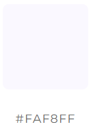
  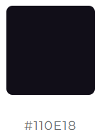
  - Vibrant colours: 
  
  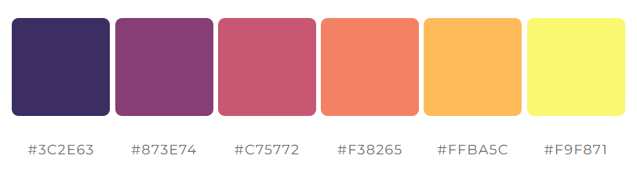

### User Stories

- As website owner I want:

- As a user I want:

### Wireframes

  
Landing page mobile

   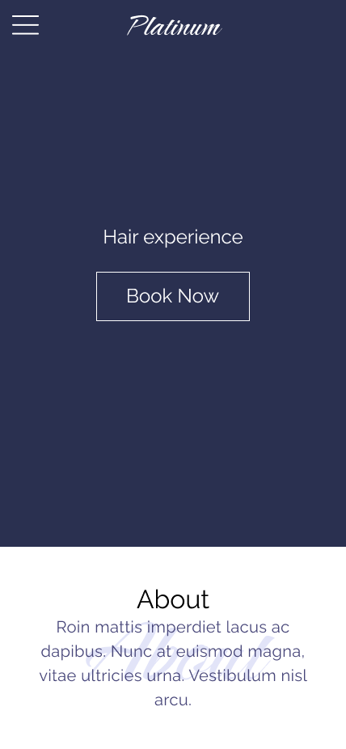
   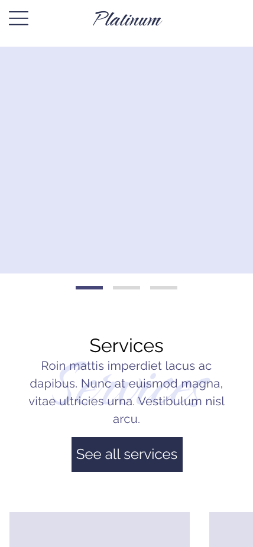 
   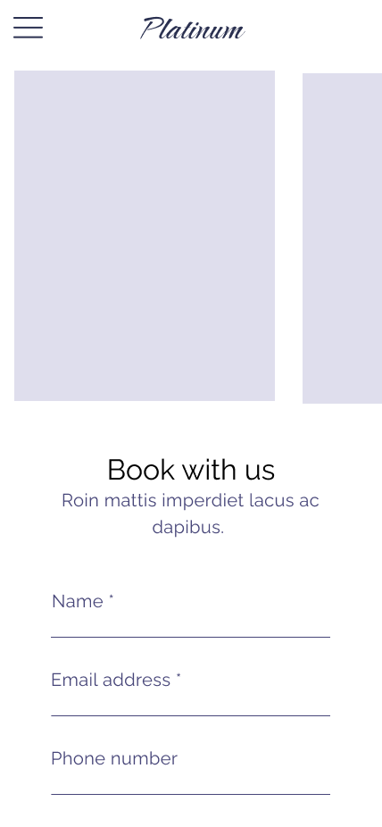 
   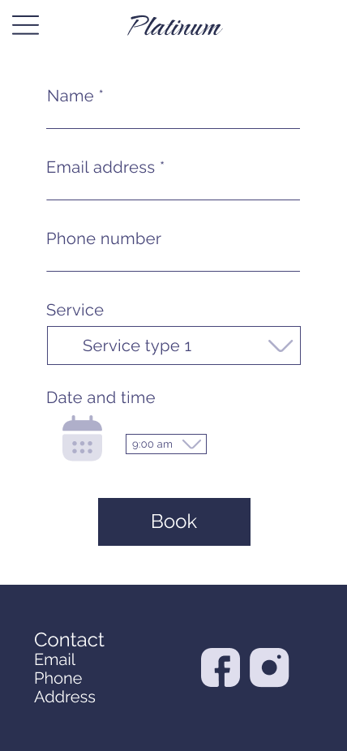 
   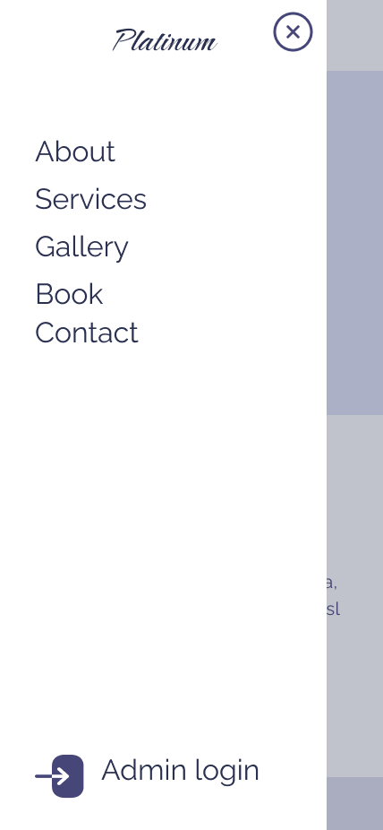 

  
Landing page desktop

   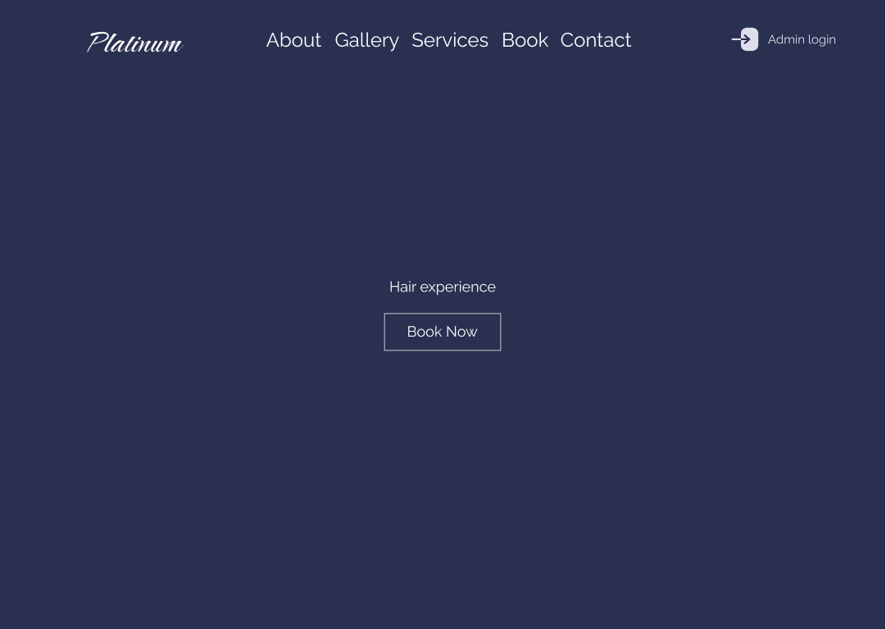
   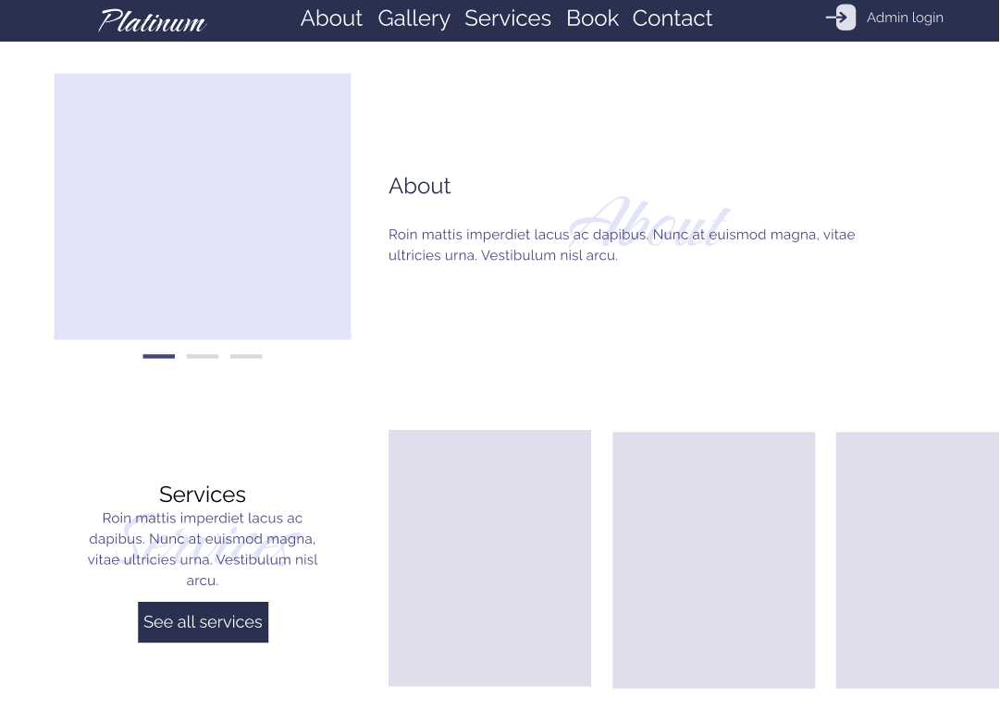
   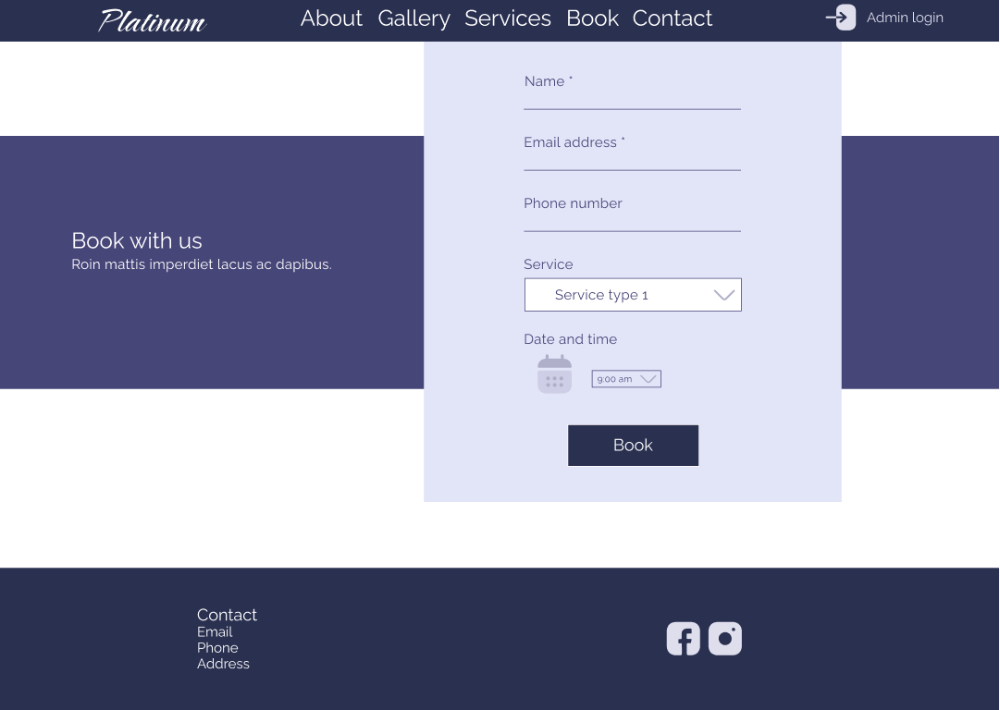

  
Staff page mobile

   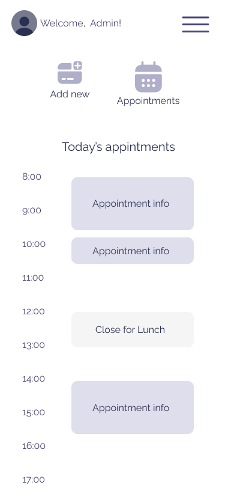
   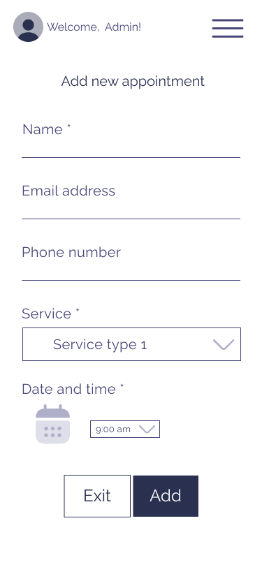
   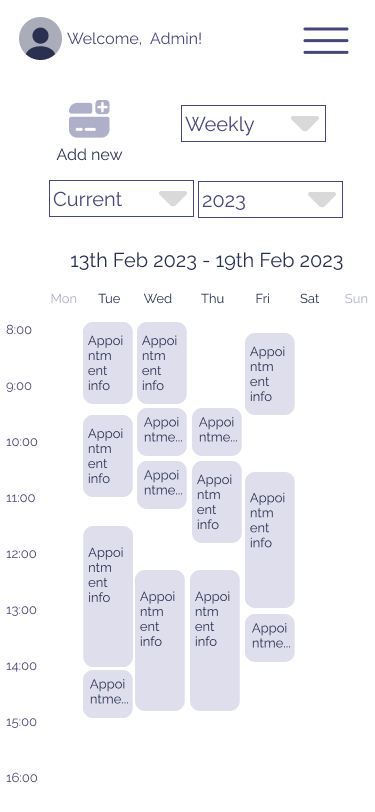
   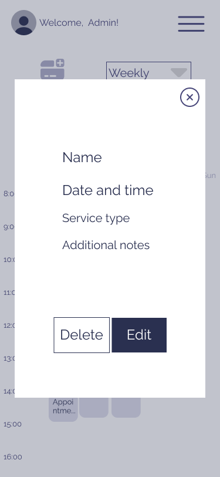
   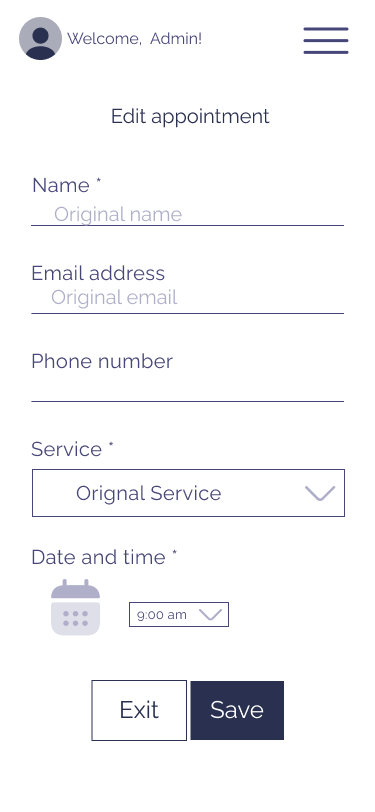
   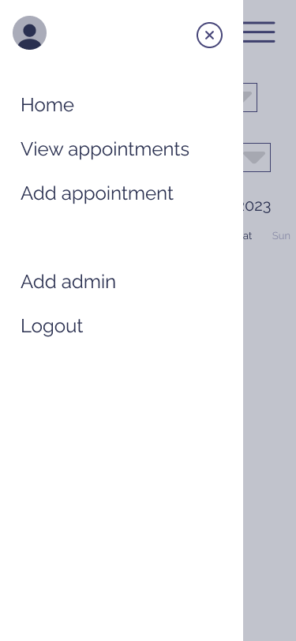

  
Staff page desktop

   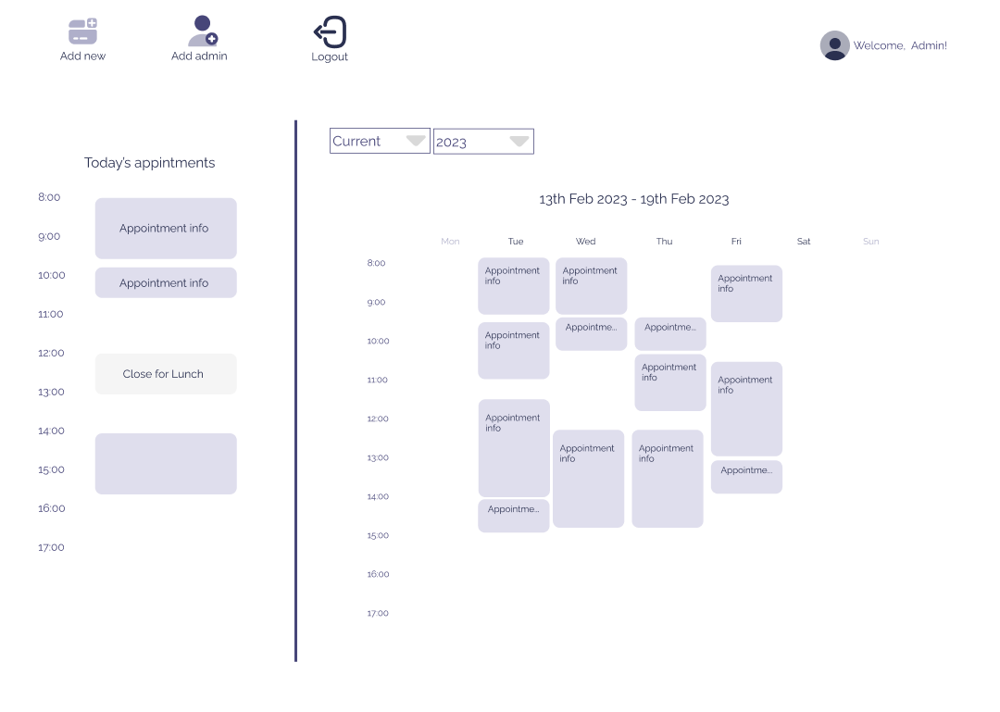
   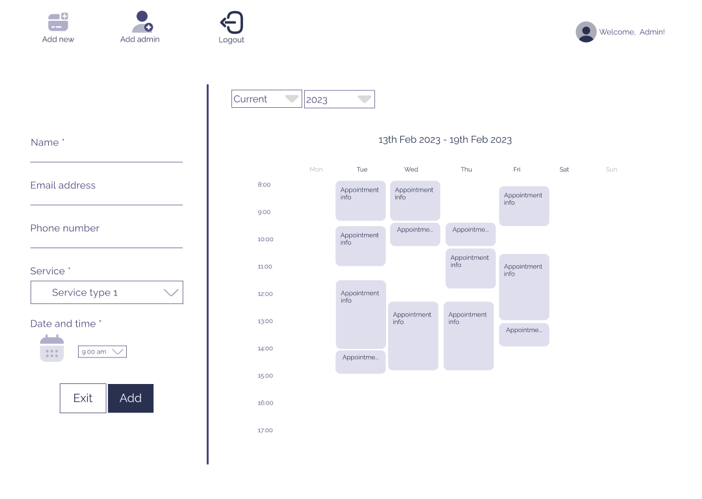
   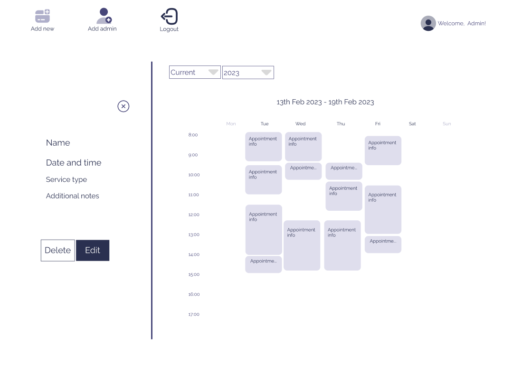

## Features 

### Landing page

- __About section__

- __Gallery__

- __Services__

- __Booking form__

- __Footer__

### Staff Page

- __Dashboard__

- __View appointments__

- __New appointment__

- __Appointment details__

- __Edit appointment__ 

- __Delete appointment__ 

- __Add staff member__

## Testing 

### Tests

### Validator Testing

#### HTML

 Check if errors are returned when passing the final version through the official [W3C validator](https://validator.w3.org/nu/#textarea)

  

  
W3 - HTML validation screenshot

  
  

#### CSS

 Check if Errors are returned when passing the final version through the official [Jigsaw validator](https://jigsaw.w3.org/css-validator/validator)

  

  
W3 - CSS validation screenshot

  
  
  

#### JavaScript

Check if Errors are returned when passing the final version through the official [JsHint validator](https://jshint.com/), but only 4 warnings.

 

  
JsHint - JS validation screenshot

  

  

### Fixed Bugs

Sign up form error

- Issue: When trying to sign up with invalid values, instead of receiving an alert under the field, the page was gicing the following error:

This was the error logged in the console: <'your.site.com'> has been blocked by CORS policy: No 'Access-Control-Allow-Origin' header is present on the requested resource.

- Fix: After troubleshooting I could identify that the issue was caused by a the missing "CLIENT_ORIGIN_DEV" valiable in the booking-api settings.py file.

Edit form not initializing date

- Issue: When trying and editing an appointment, the date input field was not initialized with the appointment date.

This was caused by an erorr in the received date format:

- Fix: To fix this error I changed the date format in booking_api, so that the format matches the required yyyy-mm-dd format.

Create appointment form throwing error 404 page not found

- Issue: When trying and access the page "my-appointments/create", axios was sending a get request to the api/my-appointments/create, instead of just redirecting to "my-appointments/create".

This was caused by a fragment I entered in the router to try display the standard navbar and footer just on some pages, and not all of them. 

This was correctly displaying the navbar and footer just for the selected paged, but it had the side effect of breaking this one route and react router was reading the url "my-appointments/create" as "my-appointments/:id", therefore trying to render the AppointmentPage component and firing the axios get request to my-appointments/:id , but with "create" in place of the id.

Hence the error 404.

- Fix: To fix this error I restored the original routes, and I added the following code to the navbar and footer components:

      /* Check the location */
      const location = useLocation();
      const [hide, setHide] = useState(false)
  
      useEffect(() => {
          /* If the location  is /dashboard, we hide set hide to true*/
          if (location.pathname === "/dashboard") {
              setHide(true);
          } else {
              setHide(false);
          }
      }, [location]);

Then I added conditional rendering to render the navbar or the footer just when hide is false.

### Unfixed Bugs

### Performance

## Deployment

### Deployment on Heroku

### Local Deployment
  - For a local deployment follow these steps:
    - Create a new directory on your machine, where you want do deploy the files
    - Open the existing repository in GitHub
    - Go to the "Code" tab
    - Click on the "Code" button
    - Copy the HTTPS link
    - Open your terminal and run the command __git clone 'link'__
    - use the link just copied, without quotes, instead of 'link'

## Credits 

### Code

### Content

- The icons were taken from [Font Awesome](https://fontawesome.com/)

- The hair icon is from [Icons 8](https://icons8.com/icon/BuTG7ooQjwHl/hairstyle)

- The following fonts, used for the project, are from [Google Fonts](https://fonts.google.com/):
  - Anton
  - Raleway
  - Caramel

- Hero image by [George Bohunicky](https://unsplash.com/@stuchy?utm_source=unsplash&utm_medium=referral&utm_content=creditCopyText) on [Unsplash](https://unsplash.com/photos/qJKT2rMU0VU?utm_source=unsplash&utm_medium=referral&utm_content=creditCopyText)

- Photo gallery 1 by [kyle smith](https://unsplash.com/@roller1?utm_source=unsplash&utm_medium=referral&utm_content=creditCopyText) on [Unsplash](https://unsplash.com/photos/4qYHqQqlwM4?utm_source=unsplash&utm_medium=referral&utm_content=creditCopyText)
  

- Photo gallery 2 by [Jonathan Cooper](https://unsplash.com/@theshuttervision?utm_source=unsplash&utm_medium=referral&utm_content=creditCopyText) on [Unsplash](https://unsplash.com/photos/sS3qRFsKZlg?utm_source=unsplash&utm_medium=referral&utm_content=creditCopyText)
  
- Photo gallery 3 by [engin akyurt](https://unsplash.com/@enginakyurt?utm_source=unsplash&utm_medium=referral&utm_content=creditCopyText) on [Unsplash](https://unsplash.com/photos/Ix4D4-8cQUU?utm_source=unsplash&utm_medium=referral&utm_content=creditCopyText)

- Photo gallery 4 by [Ali Pazani](https://unsplash.com/@alipzn?utm_source=unsplash&utm_medium=referral&utm_content=creditCopyText) on [Unsplash](https://unsplash.com/photos/3w14X-Yxffk?utm_source=unsplash&utm_medium=referral&utm_content=creditCopyText)

- Photo gallery 5 by [Adam Winger](https://unsplash.com/ko/@awcreativeut?utm_source=unsplash&utm_medium=referral&utm_content=creditCopyText) on [Unsplash](https://unsplash.com/photos/fI-TKWjKYls?utm_source=unsplash&utm_medium=referral&utm_content=creditCopyText)
  
  
## Technologies used

  - HTML
  - CSS
  - JavaScript
  - React

  Libraries:
  - React router dom - To handle navigation between pages

## Acknowledgements

A special thank to my mentor __Dick Vlaanderen__ for his precious feedback on this project.