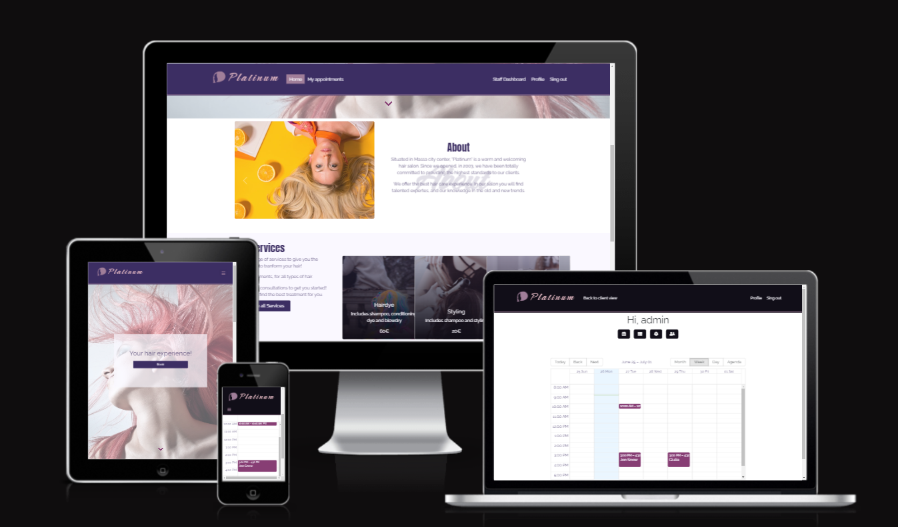

# Platinum

Platinum is an hairdresser website.
It includes both a landing page and a private area for clients, and a staff dashboard to view and manage the appointments.

The website is built in React and relies on a Django REST API.

[Link deployed website](https://platinum.herokuapp.com/)

[Link to API repository](https://github.com/EliSacch/booking-api)

## Table of content

- [Design and User Experience](#design-and-user-experience)
  - [User Stories](#user-stories)
  - [Wireframes](#wireframes)
  - [Design](#design)

- [Features](#features)
  - [Home](#home)
  - [Client Pages](#client-pages)
  - [Staff Pages](#staff-pages)
  - [Uninplemented Features](#uninplemented-features)

- [Testing](#testing)
  - [Validator Testing](#validator-testing)
  - [Manual testing](#manual-testing)
  - [Fixed bugs](#fixed-bugs)
  - [Unfixed bugs](#unfixed-bugs)
  - [Performance](#performance)

- [Deployment](#deployment)
  - [Live Website](#live-website)
  - [Local Deployment](#local-deployment)

- [Credits](#credits)
  - [Code](#code)
  - [Content](#content)

- [Technologies used](#technologies-used)

- [Acknowledgements](#acknowledgements)

## Design and User Experience

This web application was designed following the Agile methodology and by defining the users stories and implementing the features needed to meet them.

The development has been tracked using GitHub Projects feature.

[Check this project](https://github.com/users/EliSacch/projects/7)

### User Stories

#### Landing page

- As a first time user I can see see an about section, so that I can learn more about the company.

- As client I can see all offered services in one section, so that I decide if I want to make an appointment.

- As a client I can find the booking section, with relevant information on how to make an appointment.

- As a client I can easily find how to contact the business, if I have some questions or if I want to make an appointment.

- As a user I can have a simple and clear navigation, so that I can easily find the information I need.

- As a client I can see the gallery section, to be more engaged and see some results of previous clients.

#### Personal area

- As a client I can register and create a personal account, so that I can access a personal area.

- As a client I can login and out from my personal area by entering my credential, so that other clients do not have access to my information.

- As a client I can change my password if I want to, so that I can maintain a secure access.

- As a registered client, I can access some extra features from my personal area.

- As a registered user I can review and edit my profile and account information.

- As a registered user I can access my-appointments, so that I can review my past appointments, and I can view and manage upcoming appointments.

#### Staff dashboard

- As a staff member I can access a staff dashboard, so that I can utilize some extra features.

- As a staff member I can see the list of registered clients, and I can add some notes to the client profile, so that I can save important information for future appointments.

- As a staff member I can access all the appointments, so that I can review and manage them on behalf of the clients, and I an make appointments for unregistered users.

- As a staff member I can access all the services/treatments, so that I can review them and keep them up to date.

- As a staff member I have access to the calendar, so that I can review the appointments for specific day, week or month.

### Wireframes

  
Mobile landing page

   
    
    
   

  
Mobile dashboards

   
    

  
Desktop landing page

   
   
   

  
Desktop dashboard

   
   

### Design

- Color palette:
  - Neutral colours:

  
  
  - Vibrant colours: 
  
  

- Different color for staff dashboard:

The staff dashboard mantains the same style of the landing page, although it is intentionally darker, so that it is clear straight away to the staff members that they are in this page and they are logged in as staff members.

  
Check preview

   

- The following fonts, used for the project, are from [Google Fonts](https://fonts.google.com/):

  - Anton
  - Raleway
  - Caramel

## Features 

### Home

- __General Information__

The landing page contains an about section, a gallery and a services section that allows new clients to know more about the company and what it offers.

- __Booking section__

The booking section changes based on the user authentication status.

- Un-authenticated users see a message informing them about their booking options, and the clicable links to call or email directly.

- Authenticated users can see the booking form and book directly.

  
Check preview

   
   

- __Nav bar__

The navigation bar allows users to easily navigate through the website and access what they need.

The navigation bar is different based on the authentication status, and the user role.

- Unauthenticated users can see the sign in and sign up links:

  

- Authenticated clients can see the sign out button, and a link to their appointments or their profile page:

  

- Authenticated staff members can also see a link to the staff dashboard:

  

### Client pages

- __My appoinments__

Authenticated clients can access the "my appointments" page.

From here they can see a button to make an appointment and the "past" and "upcoming" appointments, in different tabs, so that they can review them. 

Clients can click on the appointment card to see more details.

For upcoming appointments they can also see the options to cancel or edit them.

- __Profile page__

The profile page offers users the option to review and manage their account and profile information.

  
Check preview

   

### Staff pages

- __Calendar__

When Staff members access the calendar and see all appointments for a specific day, week or month. They can also click on the appointment box to see more details.

  
Check preview

   

- __Appointments__

From the "Appointments" section it is possible to add new appointments, so that staff members can make appointments on behalf of the clients.

Staff members can select a client from the registered users, or they can make an appointment for unregistered users. In this case they need to enter the name.

They can also view all the appointments, and search by client.

It is possible to click on the options to delete or edit an existing appointment.

  
Check preview

   

- __Treatments__

From this section staff members can manage the treatments.

They can add a new treatment, and edit or delete an existing one.

Staff members can also see the inactive treatments.

If a treatment had been booked already, staff members cannot delete it, but they need to set is as "Inactive", this was designed for the following reasons:

- Each appointment is related to a treatment by foreign key.
- When deleting the treatment we dont want to cascade and delete all the related appiointment, beacause staff members and clients don't wont to have upcoming appointments deleted, and they might still want to review even past appointments.

Setting a treatment to inactive will hide it from the booking form, but it can be managed in this section and restored if needed.

  
Check preview

   

- __Clients__

Finally, staff members can see the list of registered users, and they can search clients by username/display name.

When clicking on the client row, staff members can see a list of details, such as name, total caount of appointments, if there is any appointment for the current day. they can also change the user role from clcient to staff (or the opposite), and they can review and add some notes. 

This might be useful to save information, such as the previous dye mix used, the preferred hair conditioning, or the hair type and best products used.

### Uninplemented Features

This application can be extended even more.
Here are some featured that I would have liked to implement:

- Multiple calendars: Because it is possible that there are more people working at the same time, it would be nice to be able to set multiple calendars, and be able to have more than one appointment at th same time, based on the availbility on the calendar of each staff member working on that day.

- Hide unavailable dates or time slots: At the moment the validation is handled by the back end, so if the user tries to book an unavailable date the appointment doesn't go through, and a message is displayed to the user.

- Email verification / password recovery : At the moment users can register and access with username and password. It would be a nice implementation if they could register using a verified email address. This way we could also implement the password reset feature, so that users can recover access to their account even if they forgot their password.

## Testing 

### Validator Testing

#### HTML

 The only HTML file present in this project is index.html and its source code was validated usisng [W3C validator](https://validator.w3.org/nu/#textarea)

 All other components are written using JSX, that cannot be validated directly, due to its specific syntax.

 It was not possible to obtain the source code of each page by copying the compiled source code within the browser, because it provides always the HTML for index.html only. Although during development all console errors related to possible HTML issues have been addressed.

In particular I had only received two kind of error:

- < p > tag inserted as child of another p tag - This message was encountered when I used a < p > tag inside a React Bootstrap Card.Text component.

- < tr > tag used outside a < tbody > element.

Both issues have been addressed and resolved.

  

  
W3 - HTML validation screenshot

  
  

#### CSS

The final version of the css files have been validated through the official [Jigsaw validator](https://jigsaw.w3.org/css-validator/validator)

When there are no errors the validator always returns the same message, therofore I believe it is not beneficial to include a screenshot for each css file.

Every warning or error will be highlighted when necessary.

Please check the following 

  

  
W3 - CSS validation screenshot

  
  | File with link | Errors | 
  | ------------ | ---------| 
  | About | No errors |
  | ActionsDropdown | No errors |
  | Appointment | No errors |
  | appointmentPage | No errors |
  | appointmentsCreateEditForm | No errors |
  | appointmentsList | No errors |
  | Asset | No errors |
  | Book | No errors |
  | CalendarComponent | No errors |
  | Clients | No errors |
  | Controls | No errors |
  | Dashboard | No errors |
  | DashboardNavBar | No errors |
  | Footer | No errors |
  | Gallery | No errors |
  | Hero | No errors |
  | Home | No errors |
  | ModalclientDetail | No errors |
  | ModalComponent | No errors |
  | Navigation | No errors |
  | NotFound | No errors |
  | Profile | No errors |
  | Services | No errors |
  | SignInUpForm | No errors |
  | Treatments | No errors |

  

No errors have been ancountered when validating the css files.

Jigsaw gave the following warnings, which although do not highligh any issue with the css analized, but it informs that some lines of code could not be checked, due to their nature.

- Css variables

- Google fonts import

- Scrollbar webkits

#### JavaScript

### Manual Testing

  

  
Landing page

  | Action | Expected Result | Pass/Fail | 
  | ------------ | ---------| ---------- |
  | Open the url | The Home page is displayed | Pass |
  | Scroll down  | The Navbar sticks to the top | Pass |
  | Click the arrow down from the "Hero" section  | The page scrolls to the about section | Pass |
  | Check the gallery | The photo slide automatically | Pass |
  | Click on the left arrow from the gallery | The previous image is displayed | Psss |
  | Click on the right arrow from the gallery | The next image is displayed | Pass |
  | Shrink and expand the page | The layout changes to be responsive | Pass |
  | Click on the "See all services button" | User is redirected to the all services page | Pass |
  | Click the "Home" link from the navbar | The user is redirected to the home page | Pass |
  | Click on the "Book" button | The page scrolls down to the book section | Pass |
  | Check the book section | Because we are logged out we see the message for logged out users | Pass |
  | Click on call us from mobile | The mobile phone pad opens with the number already provided | Pass |
  | Click on email link | The email app on our device opens up with the email address already filled in | Pass |
  | Repeat for the phone number and email address in the footer | We are prompted to call or email respectively | Pass |
  | Click on the "facebook" icon in the footer | We are redirected to facebook* | Pass |
  | Click on the "instagram" icon in the footer | We are redirected to instagram* | Pass |

  ** because this is not a real company there is no actual facebbok or instagram page.

  
Authentication

  - Sign up

  | Action | Expected Result | Pass/Fail | 
  | ------------ | ---------| ---------- |
  | Click on the Sign up button | We are redirected to the sign up page | Pass |
  | Submit the form with no data | All fields show error message stating that the field cannot be blank | Pass |
  | Enter just a username | The other two fields display a message stating that they cannot be blank | Pass |
  | Enter just the username and a password, without the confirmation | An error message informs us that the confirmation password field cannot be blank | Pass |
  | Enter all the data, but two different passwords | An error message tells us that our passwords don't match | Pass |
  | Enter matching passwords but a username that already exists | An error message informs us that a user with that username already exists | Pass |
  | Enter a valid username an two matching passwords | The sign up is successfull and we are redirected to the sign in page | Pass |
  | Click on the "Don't have an account? Sign up" link | We are redirected to the sign up page | Pass |

  - Sign in

  | Action | Expected Result | Pass/Fail | 
  | ------------ | ---------| ---------- |
  | Click on the "Already have an account? Sign in" | We are redirected to the sign in page again | Pass |
  | Go to another page, and then click on the "Sign in" link | We are redirected to the sign in page | Pass |
  | Submit the form with no information | We are informed the the fields cannot be blank | Pass |
  | Submit the form with just a username | We are informed the the password field cannot be blank | Pass |
  | Submit the form with a valid username but an invalid password | We are informed that the provided credentials are not valid | Pass |
  | Submit the form with a valid password but a valid username | We are informed that the provided credentials are not valid | Pass |
  | Enter all valid information | The sign in is successful and the user is redirected to the home page | Pass |

  
Authenticated client

  - Landing page and navigation

  | Action | Expected Result | Pass/Fail | 
  | ------------ | ---------| ---------- |
  | Check the navbar | There is no sign in or sign up link, but we can see the following links for authenticated users: my appointments, profile, log out | Pass |
  | Scroll down to the book section | The booking form is displayed | Pass |
  | Click on the "My appointments" link | The user is redirected to the "My appointments" page | Pass |
  | Click on the "Profile" link | The user is redirected to the "Profile" page | Pass |
  | Click on the sign out button | The sign out modal is displayed | Pass |
  | Click on the X button inside the modal | The modal closes with no other efefct | Pass |
  | Reopen the modal and click on the "Cancel" button | The modal closes with no other efefct | Pass |
  | Reopen the modal and click on "Confirm" | The user il logged out | Pass |

  - Profile page
  
  | Action | Expected Result | Pass/Fail | 
  | ------------ | ---------| ---------- |
  | Log in again and go to the Profile page | Each client can see his/her own information | Pass |
  | Click on "Edit profile information" button | The user is redirected to the edit profile page | Pass |
  | Click in the file input and choose an image | The new image is displayed in the preview | Pass |
  | Change the display name and click on Save | The user is redirected to the profile page and they can see the updated information | Pass |
  | Click on the edit button next to the username | The user is redirected to the page to update the username | Pass |
  | Delete the username and sibmit | An error informs us that the field cannot be blank | Pass |
  | Enter a username already taken by another user | An error informs us that a user with that username already exists | Pass |
  | Enter a valid username | The form is submitted correctly and the user is redirected to the profile page, where they can see the updated username | Pass |
  | Click on the Edit button next to the password field | The user is redirected to the page where they can change password | Pass |
  | Save with both fields empty | We are informed that the fields cannot be empty | Pass |
  | Submit with just one password at a time | We are informed that neither field can be blank | Pass |
  | Submit with different passwords | We are informed that the passwords don't match | Pass |
  | Submit with matching passwords | The form is submitted and the user is redirected to the profile page | Pass |

  - My appointments page

  | Action | Expected Result | Pass/Fail | 
  | ------------ | ---------| ---------- |
  | Click on the Upcoming appointments tab | The upcoming appointments (if any) are displayed | Pass |
  | Click on the Past appointments tab | The past appointments (if any) are displayed | Pass |
  | Click on one of the past appointment | A modal with the appointment details opens up, but there is no action button | Pass |
  | Click on the back arrow | The user is redirected to the my appointments page | Pass |
  | Click on one of the Upcoming appointments | A modal with the appointment details opens up, and there are two action button (edit and delete) | Pass |
  | Click on the edit button | The edit form opens up | Pass |
  |  | The edit functionality is tested below | |
  | Click on cancel | The user is redirected to the appointment detail page | Pass |
  | Click on delete | The delete confirmation modal opens up | Pass |
  | Click on cancel | The modal closes with no effect on the appointment | Pass |
  | Reopen the modal and click on confirm | The appointment is cancelled, the user is redirected to "My appointments" page and the cancelled appointment is not vailable anymore | Pass |

- Make an appointment

  | Action | Expected Result | Pass/Fail | 
  | ------------ | ---------| ---------- |
  | Click on the "Make an appointment" button | The user is redirected to the booking form | Pass |
  | Submit with no data | An error shows that the date field is invalid | Pass |
  | Select a date in the past | An error tells us that the date is not available | Pass |
  | Select a Sunday or monday | An error tells us that the date is not available | Pass |
  | Select a valid date (when there are no other appointments) | The form is submitted and the appointment is displaying in our "Upcoming appointments" tab | Pass |
  | Try and book for the same date and time (or when there is already another appointment)| An error tells us that the date is not available | Pass |
  | Try making a new appointment with some notes | The notes will reflect in the appointment card and detail page | Pass |

- Edit appointment

  | Action | Expected Result | Pass/Fail | 
  | ------------ | ---------| ---------- |
  | Click on one of the upcoming appointments, and then on the edit button | The user is redirected to the edit form | Pass |
  | Change appointment type, date, or time | The new information is validated in the back end, and the availability is changed based on the new information. If the new information do not conflict with existing appointments, the appointment is modified successfully and the new information are displayed in the appointment card and detail page, otherwise we receive an error message | Pass |

  
Staff member

  - Calendar

  | Action | Expected Result | Pass/Fail | 
  | ------------ | ---------| ---------- |
  | Log in as a staff member | The navbar displays the link to the staff dashboard | Pass |
  | Click on the link for the staff dashboard | The user is redirected to the dashboard and the current day calendar is displayed | Pass |
  | Click on the Next button | The appointments for the next day are showing | Pass |
  | Click on the Back button | The appointments for the previous day are showing | Pass |
  | Click on the Week button | The calendar view changes to weekly | Pass |
  | Click on the Next button | The appointments for the next week are showing | Pass |
  | Click on the Back button | The appointments for the previous week are showing | Pass |
  | Click on the Month button | The calendar view changes to monthly | Pass |
  | Click on the Next button | The appointments for the next month are showing | Pass |
  | Click on the Back button | The appointments for the previous month are showing | Pass |
  | Click on agenda | The appointments for the next week are showing as a list | Pass |
  | Click on one of the appointments | A modal opens up showing the appointment details | Pass | 

  - appointments

  | Action | Expected Result | Pass/Fail | 
  | ------------ | ---------| ---------- |
  | Click on the appointments button | The content displayed changes to the appointments list | Pass |
  | Scroll down | More appointments are laoded | Pass |
  | Click on the search bar and start typing a client name | The appointments will be filtered to display only the one belonging to a client for which it finds a partial match | Pass |
  | Click on the action button next to one appointment | A dropdown menu shows up with the edit and delete button | Pass |
  | Click on the edit icon | The edit form opens up | Pass |
  |  | The edit functionality is tested below | |
  | Click on the delete icon | The appointment is deleted and it doesn't appear in the results anymore | Pass |

  - New appointment

  | Action | Expected Result | Pass/Fail | 
  | ------------ | ---------| ---------- |
  | Click on the "Add new appointment" button | The new appointment modal opens up | Pass |
  | Submit with no data | An error shows that the date field is invalid | Pass |
  | Select a date in the past | An error tells us that the date is not available | Pass |
  | Select a valid date, but leave the client and client name fields empty | A message tells us that we need to enter a name for unregistered users | Pass |
  | Select a Sunday or monday | An error tells us that the date is not available | Pass |
  | Select a valid date (when there are no other appointments) and entering a client name | The form is submitted and the appointment is displaying appointments list and calendar | Pass |
  | Try and book for the same date and time (or when there is already another appointment)| An error tells us that the date is not available | Pass |
  | Try making a new appointment with some notes | The notes will reflect in the appointment card and detail page | Pass |
  | Try and make a new appointment, selecting a user from the clients list | If the date and time are also valid the appointment is created and it displays also for the client in "My appointments" section | Pass |

- Edit appointment

  | Action | Expected Result | Pass/Fail | 
  | ------------ | ---------| ---------- |
  | Click on the edit button | The edit appointment modal opens up | Pass |
  | Change appointment type, date, or time | The new information is validated in the back end, and the availability is changed based on the new information. If the new information do not conflict with existing appointments, the appointment is modified successfully and the new information are displayed in the appointment card and detail page, otherwise we receive an error message | Pass |

    - Treatments

  | Action | Expected Result | Pass/Fail | 
  | ------------ | ---------| ---------- |
  | Click on the treatments button | The content displayed changes to the treatments list | Pass |
  | Scroll down | More treatments are laoded | Pass |
  | Click on the search bar and start typing a treatment title | The treatments will be filtered to display only the one for which it finds a partial title match | Pass |
  | Click on the action button next to one treatment | A dropdown menu shows up with the edit and delete button | Pass |
  | Click on the edit icon | The edit form opens up | Pass |
  |  | The edit functionality is tested below | |
  | Click on the delete icon for a treatment that has not been booked yet | The treatment is deleted and it doesn't appear in the results anymore | Pass |
  | Click on the delete icon for a treatment that has been booked already | The  treatment is not deleted | Pass |

  - New treatment

  | Action | Expected Result | Pass/Fail | 
  | ------------ | ---------| ---------- |
  | Click on the "Add new treatment" button | The new treatment modal opens up | Pass |
  | Submit with no data | An error shows that the mandatory fields cannot be blank | Pass |
  | Enter a title which is already in use | An error tells us that a treatment with this title already exists | Pass |
  | Enter a valid title but no image | An error tells us that we need to upload an image | Pass |
  | Enter a valid title and image | The treatment is submitted and it appears in the list | Pass |

  - Edit treatment

  | Action | Expected Result | Pass/Fail | 
  | ------------ | ---------| ---------- |
  | Click on the edit button | The edit treatment modal opens up | Pass |
  | Change treatment information | The new title and image are validated, and if vaid the new information will display | Pass |

  - clients 
  
  | Action | Expected Result | Pass/Fail | 
  | ------------ | ---------| ---------- |
  | Click on the client button | The content changes to display the clients list | Pass |
  | Start typing in the seeach bar to find a client | The list is updated to show only clients with a matching username | Pass |
  | Click on the clcient row | A modal opens up to show the client details| Pass |
  | Click on the edit icon next to the Role | A checkbox appears to select if we want to set the user as a staff member or not | Pass |
  | Select and click on the Save icon | The Role is updated to Staff, and the user has access to the staff dashboard | Pass |
  | Repeat and deselect the checkbox | The Role is updated to Client and the user cannot access the dashboard anymore | Pass |
  | Click on the edit button next to the notes | A text area opens up to enter some notes | Pass |
  | Enter some notes and click on save | The text area closes and the newly added notes will display | Pass |
  | Click on close | The modal closes| Pass

### Fixed Bugs

Sign up form error

- Issue: When trying to sign up with invalid values, instead of receiving an alert under the field, the page was gicing the following error:

This was the error logged in the console: <'your.site.com'> has been blocked by CORS policy: No 'Access-Control-Allow-Origin' header is present on the requested resource.

- Fix: After troubleshooting I could identify that the issue was caused by a the missing "CLIENT_ORIGIN_DEV" valiable in the booking-api settings.py file.

Edit form not initializing date

- Issue: When trying and editing an appointment, the date input field was not initialized with the appointment date.

This was caused by an erorr in the received date format:

- Fix: To fix this error I changed the date format in booking_api, so that the format matches the required yyyy-mm-dd format.

Create appointment form throwing error 404 page not found

- Issue: When trying and access the page "my-appointments/create", axios was sending a get request to the api/my-appointments/create, instead of just redirecting to "my-appointments/create".

This was caused by a fragment I entered in the router to try display the standard navbar and footer just on some pages, and not all of them. 

This was correctly displaying the navbar and footer just for the selected paged, but it had the side effect of breaking this one route and react router was reading the url "my-appointments/create" as "my-appointments/:id", therefore trying to render the AppointmentPage component and firing the axios get request to my-appointments/:id , but with "create" in place of the id.

Hence the error 404.

- Fix: To fix this error I restored the original routes, and I added the following code to the navbar and footer components:

      /* Check the location */
      const location = useLocation();
      const [hide, setHide] = useState(false)
  
      useEffect(() => {
          /* If the location  is /dashboard, we hide set hide to true*/
          if (location.pathname === "/dashboard") {
              setHide(true);
          } else {
              setHide(false);
          }
      }, [location]);

Then I added conditional rendering to render the navbar or the footer just when hide is false.

Staff Appointment Create form giving error

- Issue: When trying to book using the staff appointment create form, we received the following error:

This was caused by the fact that I was passing the client.owner value, while the pk was expected.

- Fix: To fix this error I changed the code to pass the client.id as value:

### Unfixed Bugs

There are not known unfixed bugs at the moment.

### Performance

All the pages were checked using lighthouse

| Page | Performance | Accessibility | Best Practices | SEO |
| ---- | ----------- | ------------- | -------------- | --- |
|

## Deployment

### Deployment on Heroku

### Local Deployment
  - For a local deployment follow these steps:
    - Create a new directory on your machine, where you want do deploy the files
    - Open the existing repository in GitHub
    - Go to the "Code" tab
    - Click on the "Code" button
    - Copy the HTTPS link
    - Open your terminal and run the command __git clone 'link'__
    - use the link just copied, without quotes, instead of 'link'

## Credits 

### Code

### Content

- The icons were taken from [Font Awesome](https://fontawesome.com/)

- The hair icon is from [Icons 8](https://icons8.com/icon/BuTG7ooQjwHl/hairstyle)

- Hero image by [George Bohunicky](https://unsplash.com/@stuchy?utm_source=unsplash&utm_medium=referral&utm_content=creditCopyText) on [Unsplash](https://unsplash.com/photos/qJKT2rMU0VU?utm_source=unsplash&utm_medium=referral&utm_content=creditCopyText)

- Photo gallery 1 by [kyle smith](https://unsplash.com/@roller1?utm_source=unsplash&utm_medium=referral&utm_content=creditCopyText) on [Unsplash](https://unsplash.com/photos/4qYHqQqlwM4?utm_source=unsplash&utm_medium=referral&utm_content=creditCopyText)
  

- Photo gallery 2 by [Jonathan Cooper](https://unsplash.com/@theshuttervision?utm_source=unsplash&utm_medium=referral&utm_content=creditCopyText) on [Unsplash](https://unsplash.com/photos/sS3qRFsKZlg?utm_source=unsplash&utm_medium=referral&utm_content=creditCopyText)
  
- Photo gallery 3 by [engin akyurt](https://unsplash.com/@enginakyurt?utm_source=unsplash&utm_medium=referral&utm_content=creditCopyText) on [Unsplash](https://unsplash.com/photos/Ix4D4-8cQUU?utm_source=unsplash&utm_medium=referral&utm_content=creditCopyText)

- Photo gallery 4 by [Ali Pazani](https://unsplash.com/@alipzn?utm_source=unsplash&utm_medium=referral&utm_content=creditCopyText) on [Unsplash](https://unsplash.com/photos/3w14X-Yxffk?utm_source=unsplash&utm_medium=referral&utm_content=creditCopyText)

- Photo gallery 5 by [Adam Winger](https://unsplash.com/ko/@awcreativeut?utm_source=unsplash&utm_medium=referral&utm_content=creditCopyText) on [Unsplash](https://unsplash.com/photos/fI-TKWjKYls?utm_source=unsplash&utm_medium=referral&utm_content=creditCopyText)
  
  
## Technologies used

  - HTML
  - CSS
  - JavaScript
  - React

  Libraries:
  - React router dom - To handle navigation between pages

## Acknowledgements

A special thank to my mentor __Dick Vlaanderen__ for his precious feedback on this project.